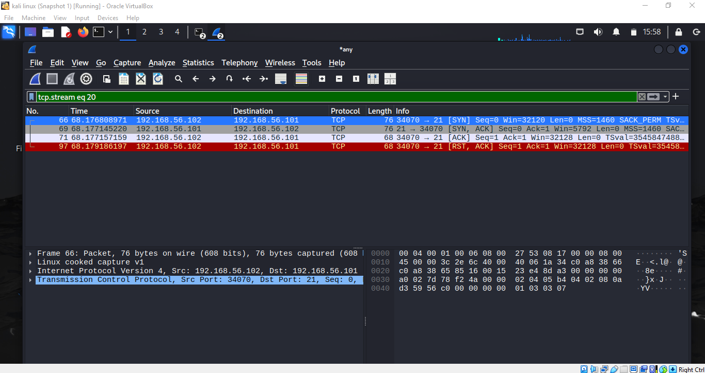
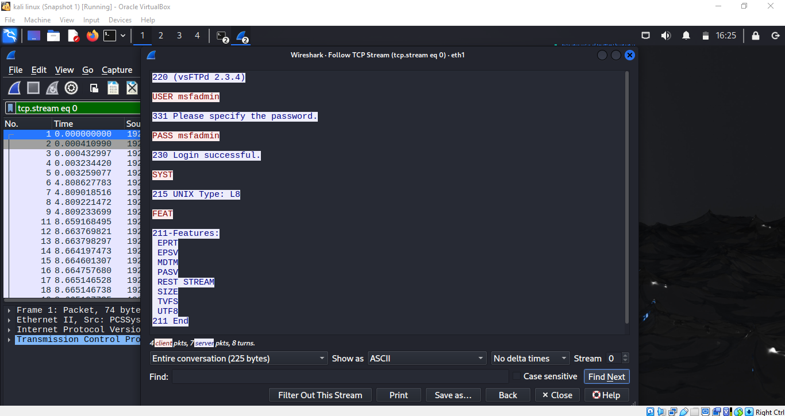
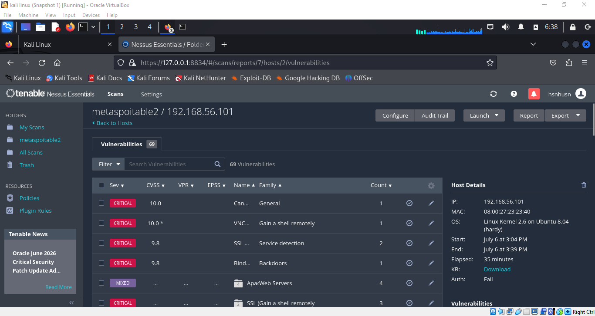
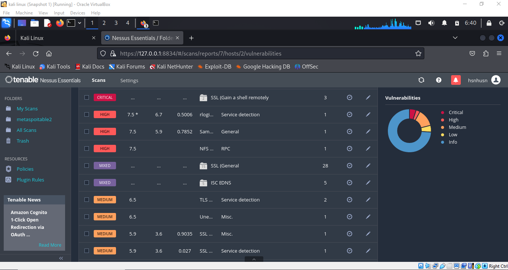

# Initial Network Reconnaissance Report

## Assessment Information

**Target:** Metasploitable2
**Target IP:** 192.168.56.101
**Assessment Date:** 29 June 2026
**Assessor:** Hassan Hussain

## Objective

Identify live hosts and discover exposed TCP services on the target machine.

## Scope

One internal host: 192.168.56.101

## Methodology

**Tool Used:** Nmap
**Command:** `nmap 192.168.56.101`

## Findings

### Host Status
The target host responded successfully and was online during testing.

### Open Services Identified
- FTP (21)
- SSH (22)
- Telnet (23)
- SMTP (25)
- DNS (53)
- HTTP (80)
- RPCBind (111)
- NetBIOS (139)
- SMB (445)
- MySQL (3306)
- PostgreSQL (5432)
- VNC (5900)
- Additional services on ports 512, 513, 514, 1099, 1524, 2049, 2121, 6000, 6667, 8009, 8180

## Service Version Detection

**Command:** `nmap -sV 192.168.56.101`

### Critical Findings

| Port | Service | Version | Risk |
|------|---------|---------|------|
| 21 | FTP | vsftpd 2.3.4 | Critical — known backdoor CVE-2011-2523 |
| 1524 | Bindshell | Metasploitable root shell | Critical — open root shell |
| 23 | Telnet | Linux telnetd | High — plaintext credentials |
| 6667 | IRC | UnrealIRCd | Critical — known backdoor |
| 3306 | MySQL | 5.0.51a-3ubuntu5 | High — outdated version |
| 5900 | VNC | Protocol 3.3 | High — old protocol |
| 8180 | HTTP | Apache Tomcat 1.1 | High — multiple known exploits |

**Summary:** Target exposes 22 open services with multiple critically outdated versions. vsftpd 2.3.4 and UnrealIRCd contain known backdoors exploitable without authentication.

## Traffic Verification (Wireshark)

**Tool:** Wireshark, captured on Kali interface eth1

### TCP Three-Way Handshake — Port 21 (FTP)

Confirms FTP service is live and responding, verified at the packet level (SYN → SYN-ACK → ACK), matching Nmap's finding that port 21 is open.

### Plaintext Credential Capture — Successful Login

Using Wireshark's Follow TCP Stream feature, captured a complete FTP session in plaintext:
- Banner: vsFTPd 2.3.4
- Username: msfadmin
- Password: msfadmin
- Result: 230 Login successful

This proves the vulnerability is not theoretical — valid credentials were transmitted in cleartext and successfully used to gain authenticated access.

## Automated Vulnerability Scan (Nessus Essentials)

**Tool:** Nessus Essentials
**Target:** 192.168.56.101
**Scan Duration:** 35 minutes
**Total Findings:** 69 vulnerabilities

### Host Details

- OS: Linux Kernel 2.6 on Ubuntu 8.04 (hardy)
- MAC: 08:00:27:23:23:40

### Critical Findings Overview

| Finding | CVSS | Category |
|---------|------|----------|
| Unsupported/EOL Operating System | 10.0 | General |
| VNC — Gain a shell remotely | 10.0 | Remote Shell Access |
| SSL Service Detection (x2) | 9.8 | Service Detection |
| Bindshell Backdoor | 9.8 | Backdoors |
| SSL — Gain a shell remotely (x3) | Critical | Remote Shell Access |

### Additional Notable Findings
- Apache Web Servers — 4 mixed-severity findings
- rlogin service detection — High
- Samba (SMB) general findings — High
- NFS RPC exposure — High
- 28 SSL-related general findings — Mixed severity
- 5 ISC BIND DNS findings — Mixed severity

## Overall Risk Summary

Three independent tools confirm the same conclusion from different angles:

- **Nmap** identified 22 open services, several critically outdated
- **Wireshark** proved exploitability — captured and verified a successful authenticated login using cleartext credentials
- **Nessus** confirmed scale — 69 total vulnerabilities, including two independent critical unauthenticated remote-shell access points

This is not a theoretical risk assessment — actual credential compromise was demonstrated and reproduced.

## Recommendations

- **Immediate:** Patch or replace vsftpd 2.3.4 and UnrealIRCd; disable VNC and the bindshell service on port 1524
- **Short-term:** Enforce SSH-only remote access; disable Telnet and rlogin entirely
- **Long-term:** Full OS upgrade — current Ubuntu 8.04 is fully end-of-life and unsupported
